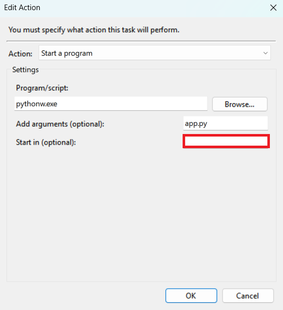

# MonitorControl

Use your keyboard shortcuts to control multiple External Displays simultaneously.
- Brightness
    - Key combo triggers prompt, allowing the user to set the brightness.
- Input Sources
    - Key combo toggles between preset input sources

This project uses the python `monitorcontrol` package (https://github.com/newAM/monitorcontrol) to send DDC-CI commands to external displays.
- `v3.1.0` `monitorcontrol` source code stored as zip in root of this repo 

# Setup
Install the following Python Packages:

`pip install monitorcontrol`

## Edit Configs
Edit `config.txt` for your display setup

## Windows Instructions
`launcher.bat`
- Will launch and prompt user to set display brightness

`monitor_switcher.bat`
- will toggle between the two profiles. (Switch monitor inputs)

For each of the above bat files:

1. Create a shortcut (may need to copy the shortcut to e.g. the Desktop)
2. Right click the shortcut and go to `Properties`
3. Got to the `Shortcut` tab and assign a `Shortcut Key` e.g. `Ctrl+Alt+Z`

Whenever you press that key combination the corresponding bat file will launch.

## Windows Flask App
1. Open Task Scheduler:
    
    - Press Win + R
    - type `taskschd.msc`
    - press Enter.

2. Create a New Task:

    - In the Task Scheduler window, click on "Create Basic Task" or "Create Task" on the right pane.

3. Set Up the Task:

    - Name: Give your task a name (e.g., "Run Python Script").
    - Trigger: Set the conditions for when you want the task to run (e.g., daily, at startup).
    - Action: Choose "Start a Program" and browse to pythonw.exe. In the "Add arguments" field, enter the path to your script:

        `"C:\Path\To\Your\Script\your_script.py"`

    - Finish: Complete the wizard and save the task.

        
## Linux Instructions
tba